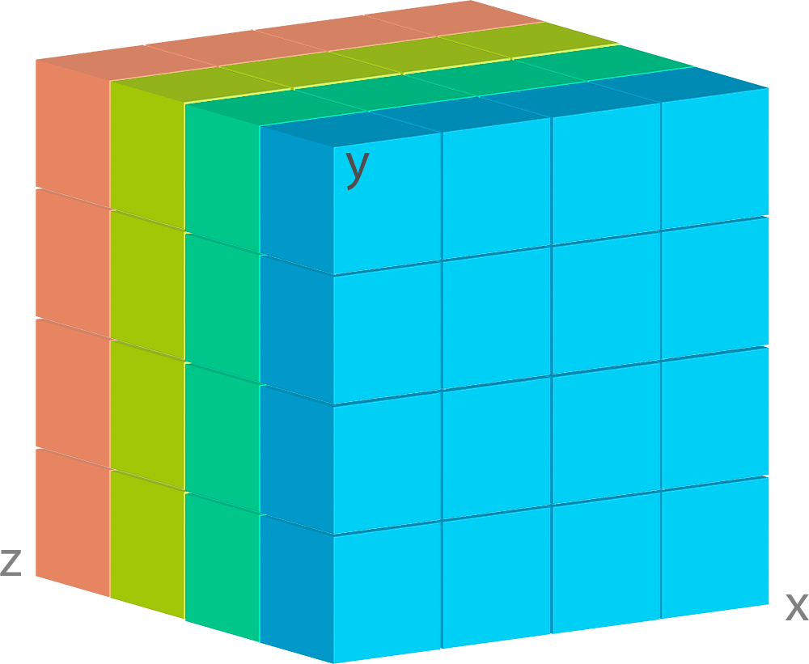

*****************
Collection Schema
*****************

Introduction
============

In some aspects Deker is similar to other database management systems. It has *collections* which
are equivalent to tables in relational databases or collections in MongoDB.

Collection stores one of two flavors of *arrays* supported by Deker. We would look into difference
between them later in this tutorial, but for now it is important to understand that *array* is
defined by the *schema* associated with the *collection* where it is stored.

Collection *schema* consists from several components:

    * *Dimensions* schema defining number of array dimensions, their size, step and labels or
      scales that simplify addressing particular dimension
    * *Primary attributes* schema defines mandatory attributes that constitute unique identifier
      of particular *array* that could be used to locate it inside the collection
    * *Custom attributes* schema defines optional attributes that could be stored along the
      particular *array* but could not be used to locate it

.. attention::
   *Dimensions* and both *primary* and *custom attributes* schemas are **immutable**. Once you
   have created collection, you will only be able manage *arrays* in it and modify their *custom
   attributes* value.

Understanding Array Flavors
===========================

Two flavor of *arrays* supported by Deker are ``Array`` and ``VArray``. Those objects represent
core concept of Deker storage. Hereafter we will describe their structure, differences and
commonalities and give overview of when either of them should be used.

Array
-----

``Array`` is a wrapper over physical file containing actual array data.

.. |cell| image:: images/cell.png
   :scale: 5%

Each array consists of individual cells |cell| containing singular data values.

Let's consider a simple 3D array containing current weather data bound to some grid:

.. image:: images/legend.png
   :scale: 28%
   :align: right

Let's assume that ``X`` and ``Y`` axes represent geographical grid, and ``Z`` axis represents
layers with particular weather characteristic values, as shown in the legend.

In the illustration above single ``Array`` has 4 cells in each dimension, in other words its
*shape* is ``(4, 4, 4)``.

Deker will store each ``Array`` data in a separate file, and when we retrieve this ``Array`` object
from ``Collection`` and access its data, all operations will affect this file only.

VArray
------

From the developer point of view ``VArray`` is almost indistinguishable from ``Array``.

Like ``Array`` it has *dimensions*, *primary* and *custom attributes*, it is stored in *collection*
and all operations that could be performed on ``Array`` could be performed on ``VArray`` as well.

But there is a significant difference in its implementation.

Imagine that instead of data bound to 4x4 grid you need to store a high-resolution image of
something really huge like whole Earth surface satellite image. Let's say that size of such image
would be 300000x200000 px. If stored in single file it will produce large filesystem objects
that will impose limitations on concurrent read-write access thus impending storage scalability.

To optimize this type of data storage, Deker uses tiling, i.e. it splits large ``VArray`` objects
into series of smaller ``Array`` objects and transparently join them into for user access as
virtual array. It probably would still be impossible to access this huge array as a whole, but it
enables efficient access to digestible parts of it piece by piece.

.. image:: images/vgrid.png
   :scale: 35%

``VArray`` is a wrapper over such a set of files. In the image above you can see how it is split
into separate *tiles* (``Array`` objects) with regular *grid*.

If ``Collection`` is defined to contain ``VArray`` objects, you don't have to worry about tiling,
Deker would transparently manage this for you under the hood.

When some slice of data is queried from the ``VArray``, it automatically calculates which files
need to be opened to retrieve it and what part of requested slice data bounds belong to each of
each file.

For example, let's consider ``VArray`` with dimensions ``['X', 'Y', 'Z']`` and shape ``(4, 4, 4)``,
with its *zero-index* at the front-left-bottom corner.

.. image:: images/varray.png
   :scale: 30%

Let's query the following slice of it: ``[1:4, :, :]``

.. image:: images/varray_request.png
   :scale: 30%

Here you can see, that all 4 tile files will be affected, but only the highlighted pieces of them
will be actually read or written. All different files reads or writes could be done in parallel.
In case you are retrieving data, Deker will transparently combine each read piece into subset with
requested shape and return it to you. If you use these bounds to write data, Deker will
automatically split the slice you have provided into pieces and write them in parallel to
corresponding files.

Dimensions Order
================

It is important to remember that all array dimensions have strict order which is significant for
your data storage design.

Let's have a look at array image:

.. image:: images/legend.png
   :scale: 28%
   :align: right

As usual, every array has just one *entrance point*. You cannot get inner data without passing
through outer layers, but there is only one *gate* for each layer.

When you decide on the dimensions positioning, you shall understand and keep in mind your usual
querying patterns. Correct positioning will make the querying faster, a wrong one will slow it.

Assume, that our *gates* are always at the front face, as shown by the arrows, and the dimensions
are arranged as ``['X', 'Y', 'Z']``:

.. image:: images/array_0_arrows.png
   :scale: 30%

.. image:: images/legend.png
   :scale: 28%
   :align: right

It means that when we query our data, in the first place we capture ``X`` dimension, then ``Y``
dimension and only after that we can get to our weather data. As long as weather layers are under
the geo grid, such a sequence perfectly fits for querying a pack of weather data for some
geo points.

But what if we place these dimensions in a different manner?

.. image:: images/array_1_arrows.png
   :scale: 30%

.. image:: images/array_2_arrows.png
   :scale: 30%
   :align: right

Now each geo point contains only one sort of information. Moreover, you can place these dimensions
in such a way, when weather layers will become the first dimension, for example like
``['Z', 'Y', 'X']``.

It entails that each its cell contains all the geo-grid, and the queries become much slower.

So, before positioning the dimensions, you'd better decide how you are going to query your data and
what order is the most suitable for such queries.

Dimensions Schemas
==================

Each dimension shall have its ``size`` - a precise non-zero positive quantity of its cells with a
constant scalar step ``1``.

We believe that every piece of data shall be described, otherwise it is just a number or a
meaningless symbol. Each dimension, regardless of its type, shall have at least a unique ``name``.

.. note::
   The final sequence of your dimensions schemas represents the exact shape of the future
   ``Array`` or ``VArray``.

Dimension Schema
----------------

Here is an example of ``DimensionSchema`` declaration::

    from deker import DimensionSchema

    dimensions = [
        DimensionSchema(name="height", size=255),
        DimensionSchema(name="width", size=512),
    ]

Even if you need an array with only one dimension, it shall still be defined as a list (or a tuple)
of dimension schemas::

    dimension = (
        DimensionSchema(name="total_daily_income", size=366),
    )

.. note::
   ``DimensionSchema`` is kept in the ``Collection`` metadata and converted into ``Dimension``
   object for each ``Array`` or ``VArray`` of such ``Collection``.

All right, now we have a list of two dimensions, named ``"height"`` and ``"width"``. They have some
size, but what are the units? Is there any regular scale for their values? Definitely, there should
be.

Scale
~~~~~

If a dimension has a real regular scale, we may indicate it::

    from deker import DimensionSchema, Scale

    dimensions = [
        DimensionSchema(
            name="height",
            size=255,
            scale=Scale(start_value=0.0, step=0.01, name="meters")
        ),
        DimensionSchema(
            name="width",
            size=512,
            scale={"start_value": 1.0, "step": 0.5}
        ),
    ]

As you can see, regular scale can be defined either with Python ``dict`` or with Deker ``Scale``
named tuple. The keyword ``name`` is optional. Scale values shall be always defined as ``floats``.

The parameters ``step`` and ``start_value`` may be negative as well. For example, ``era5`` weather
model has a geo grid shaped ``(ys=721, xs=1440)`` with step ``0.25`` degrees per cell. The
zero-point of the ``map`` is north-west or left-upper corner. In other words ``era5`` grid point
``(0, 0)`` is set to coordinates ``(lat=90.0, lon=-180.0)``.

Here is an example of how this grid can be bound to real geographical coordinates in Deker::

    dimensions = [
        DimensionSchema(
            name="y",
            size=721,
            scale=Scale(start_value=90.0, step=-0.25, name="lat")
        ),
        DimensionSchema(
            name="x",
            size=1440,
            scale={"start_value": -180.0, "step": 0.25, "name": "lon"}
        ),
    ]

Now you can be sure that ``dimensions[0][0], dimensions[1][0]`` are bound to
``lat=90.0, lon=-180.0`` and ``dimensions[0][-1], dimensions[1][-1]`` are bound to
``lat=-90.0, lon=179.75`` and ``lat=0.0, lon=0.0`` can be found at
``dimensions[0][360], dimensions[1][720]``.

Labels
~~~~~~

If a dimension has no real regular scale, but there is still a certain logic in its values order,
we may use ``labels`` to describe it::

    dimensions = [
        DimensionSchema(
            name="weather_layers",
            size=4,
            labels=["temperature", "pressure", "wind_speed", "humidity"],
        ),
    ]

You can provide not only a list of ``strings``, but a list (or a tuple) of ``floats`` as well.

Both ``labels`` and ``scale`` provide a mapping of some reasonable information onto your data
cells. If ``labels`` is always a full sequence kept in metadata and in memory, ``scale`` is
calculated dynamically.

As for the example with ``labels``, we can definitely state that calling index ``[0]`` will provide
temperature data, and index ``[2]`` will give us wind speed and nothing else. The same works for
scaled dimensions. For example, height index ``[1]`` will keep data relative to height
``0.01 meters`` and index ``[-1]`` - to height ``2.54 meters``.

If you set some ``scale`` or ``labels`` for your dimensions, it will allow you to slice these
dimensions not only with ``integer``, but also with ``float`` and ``string`` (we will dive into it
in the section about fancy slicing).

Time Dimension Schema
---------------------

If you need to describe some time series you shall use ``TimeDimensionSchema``.

.. note::
   ``TimeDimensionSchema`` is kept in the ``Collection`` metadata and converted into
   ``TimeDimension`` object for each ``Array`` or ``VArray`` of such ``Collection``.

``TimeDimensionSchema`` is an object, which is completely described by default, so it needs no
additional description. Thus, it allows you to slice ``TimeDimension`` with ``datetime`` objects
or ``float`` timestamps or even ``string`` (ISO 8601 formatted).

Like ``DimensionSchema`` it has ``name`` and ``size``, but also it has its special arguments.

Start Value
~~~~~~~~~~~

Consider the following ``TimeDimensionSchema``::

    from datetime import datetime, timedelta, timezone
    from deker import TimeDimensionSchema

    dimensions = [
        TimeDimensionSchema(
            name="dt",
            size=8760,
            start_value=datetime(2023, 1, 1, tzinfo=timezone.utc),
            step=timedelta(hours=1)
        ),
    ]

It covers all the hours in the year 2023 starting from 2023-01-01 00:00 to 2023-12-31 23:00
(inclusively).

Direct setting of the ``start_value`` parameter will make this date and time a **common
start point** for all the ``Array`` or ``VArray``. Sometimes it makes sense, but usually we want
to distinguish our data by individual time. In this case, it should be defined as follows::

    dimensions = [
        TimeDimensionSchema(
            name="dt",
            size=8760,
            start_value="$some_attribute_name",
            step=timedelta(hours=1)
        ),
    ]

A bit later you will get acquainted with ``AttributesSchema``, but for now it is important to note,
that providing ``start_value`` schema parameter with an **attribute name** starting with ``$`` will
let you set an individual start point for each new ``Array`` or ``VArray`` at its creation.

.. attention::
   For ``start_value`` you can pass a datetime value with any timezone (e.g. your local timezone),
   but you should remember that Deker converts and stores it in the UTC timezone.

   Before querying some data from ``TimeDimension``, you should convert your local time to UTC to
   be sure that you get a pack of correct data. You can do it with ``get_utc()`` function from
   ``deker_tools.time`` module.

Step
~~~~

Unlike ordinary dimensions ``TimeDimensionSchema`` shall be provided with ``step`` value, which
shall be described as a ``datetime.timedelta`` object. You may certainly set any scale for it,
starting with microseconds, ending with weeks, it will become a mapping for the dimension scalar
indexes onto a certain datetime, which will let you slice it in a fancy way.

.. note::

   **Why are integers inapplicable to timestamps and to scale and labels values?**

   Integers are reserved for native Python indexing.

   If your **timestamp** is an integer - convert it to float.
   If your **scale** ``start_value`` and ``step`` are integers - define them as corresponding floats.
   If your **labels** are integers for some reason - convert them to strings or floats.

Attributes Schema
=================

All databases provide some additional obligatory and/or optional information concerning data. For
example, in SQL there are primary keys which indicate that data cannot be inserted without passing
them.

For this purpose Deker provides **primary** and **custom attributes** which shall be defined as a
list (or a tuple) of ``AttributeSchema``::

    from deker import AttributeSchema

    attributes = [
        AttributeSchema(
            name="some_primary_attribute",
            dtype=int,
            primary=True
        ),
        AttributeSchema(
            name="some_custom_attribute",
            dtype=str,
            primary=False
        ),
    ]

Here we defined a pack of attributes, which will be applied to each ``Array`` or ``VArray`` in our
``Collection``. Both of them have a ``name`` and a ``dtype`` of the values you are going to pass
later.

Regardless their ``primary`` flag value, their names **must be unique**. Valid ``dtypes`` are the
following:

    * ``int``
    * ``float``
    * ``complex``
    * ``str``
    * ``tuple``
    * ``datetime.datetime``

The last point is that one of the attributes is ``primary`` and another is ``custom``. What does it
mean?

Primary Attributes
------------------

.. note::
   Attribute for ``TimeDimension`` ``start_value`` indication shall be dtyped ``datetime.datetime``
   and may be **primary**.

.. attention::
   It is highly recommended to define at least one **primary** attribute in every schema.

Primary attributes are a strictly ordered sequence. They are used for ``Array`` or ``VArray``
filtering. When Deker is building its file system, it creates symlinks for main data files using
primary attributes in the symlink path. If you need to get a certain ``Array`` or ``VArray`` from a
``Collection``, you have two options how to do it:

    * pass its ``id``,
    * or indicate **all** its primary attributes' values.

.. attention::
   Values for all the primary attributes **must be passed** at every ``Array`` or ``VArray``
   creation.

Custom Attributes
-----------------

.. note::
   Attribute for ``TimeDimension`` ``start_value`` indication shall be dtyped ``datetime.datetime``
   and may be **custom** as well.

No filtering by custom attributes is available at the moment. They just provide some optional
information about your data. You can put there anything, that is not very necessary, but may be
helpful for the data managing.

Custom attributes are the only mutable objects of the schema. It does not mean that you can change
the schema, add new attributes or remove old ones. It means that you can change their values (with
respect to the specified ``dtype``) if needed. You can also set their values to ``None``, except
the attributes dtyped ``datetime.datetime``.

.. attention::
   Values for custom attributes **are optional for passing** at every ``Array`` or ``VArray``
   creation.

   If nothing is passed for some or all of them, they are set to ``None``.

   This rule concerns all the custom attributes **except custom attributes dtyped**
   ``datetime.datetime``. Values for custom attributes dtyped ``datetime.datetime`` **must be
   passed** at every ``Array``  or ``VArray`` creation and **cannot be set to** ``None``.

.. note::
   Defining ``AttributeSchemas`` is optional: you **may not set** any primary or custom attribute
   (**except** attribute for ``TimeDimension.start_value`` indication).

Array and VArray Schemas
========================

Since you are now well informed about the dimensions and attributes, we are ready to move to the
arrays' schemas. Both ``ArraySchema`` and ``VArraySchema`` must be provided with a list of
dimensions schemas and ``dtype``. You may optionally pass a list of attributes schemas and
``fill_value`` to both of them.

Data Type
---------

Deker has a strong data typing. All the values of all the ``Array``  or ``VArray`` objects in one
``Collection`` shall be of the same data type. Deker accepts numeric data of the following NumPy
data types:

    * ``numpy.int8``
    * ``numpy.int16``
    * ``numpy.int32``
    * ``numpy.int64``
    * ``numpy.float16``
    * ``numpy.float64``
    * ``numpy.float128``
    * ``numpy.longfloat``
    * ``numpy.double``
    * ``numpy.longdouble``
    * ``numpy.complex64``
    * ``numpy.complex128``
    * ``numpy.complex256``
    * ``numpy.longcomplex``
    * ``numpy.longlong``

Python ``int``, ``float`` and ``complex`` are also acceptable. They are correspondingly converted
to ``numpy.int32``, ``numpy.float64`` and ``numpy.complex128``.

Fill Value
----------

Sometimes it happens that we have no values for some cells or we want to clear our data out in full
or in some parts. Unfortunately, NumPy does not allow you to set python ``None`` to such cells.
That's why we need something that will fill them in.

Rules are the following:

1. ``fill_value`` **shall not be significant** for your data.
2. ``fill_value`` **is optional** - you may not provide it. In this case Deker will choose it
   automatically basing on the provided ``dtype``. For ``integer`` data types it will be the lowest
   value for the correspondent data type bit capacity. For example, it will be ``-128`` for
   ``numpy.int8``. For ``float`` data types (including ``complex``) it will be ``numpy.nan`` as
   this type is also ``floating``.
3. If you would like to set it manually, ``fill_value`` shall be of the same data type, that was
   passed to the ``dtype`` parameter. If all the values of the correspondent ``dtype`` are
   significant for you, you shall choose a data type of a greater bit capacity. For example, if all
   the values in the range ``[-128; 128]`` are valid for your dataset, you'd better choose
   ``numpy.int16`` instead of ``numpy.int8`` and set ``-129`` as ``fill_value`` or let Deker to set
   it automatically. The other workaround is to choose any floating data type, e.g.
   ``numpy.float16``, and have ``numpy.nan`` as a ``fill_value``.

Now, let's create once again some simple dimensions and attributes for both types of schemas::

    from deker import DimensionSchema, AttributeSchema

    dimensions = [
        DimensionSchema(name="y", size=100),
        DimensionSchema(name="x", size=200),
    ]

    attributes = [
        AttributeSchema(name="attr", dtype=str, primary=False)
    ]

Array Schema
------------

Let's define schema for ``Collection`` of ``Array``::

    from deker import ArraySchema

    array_schema = ArraySchema(
        dimensions=dimensions,
        attributes=attributes,
        dtype=float,  # will be converted and saved as numpy.float64
        # fill_value is not passed - will be numpy.nan
    )

VArray Schema
--------------

And schema of ``Collection`` of ``VArray``::

    from deker import VArraySchema

    varray_schema = VArraySchema(
        dimensions=dimensions,
        dtype=np.int64,
        fill_value=-99999,
        vgrid=(50, 20)
        # attributes are not passed as they are optional
    )

VArray Grid
~~~~~~~~~~~

.. note:: ``arrays_shape`` parameter added in v1.1.0

Perhaps it is one of the most obscure issues. ``VArray`` shall be split into files, but it cannot
decide itself how it shall be done. It's up to you, how you are going to split your data.
There are two ways: ``vgrid`` and ``arrays_shape`` parameters. You can choose any of them,
but not both. Any of these parameters shall be defined as a tuple of integers which quantity
shall be exactly similar to the quantity of the dimensions and its values shall divide ``VArray``
shape without remainders.

Our schema has two dimensions with sizes ``100`` and ``200`` correspondingly, what tells us
that the ``VArray`` shape will be ``(100, 200)``. We shall split it either by ``vgrid`` or
with ``arrays_shape``.

``vgrid``
+++++++++

Let's set ``vgrid`` as ``(50, 20)``.

.. code-block:: python

   from deker import VArraySchema

   varray_schema = VArraySchema(
       dimensions=dimensions,
       dtype=np.int64,
       fill_value=-99999,
       vgrid=(50, 20)
       # attributes are not passed as they are optional
   )

What shall happen? No magic, just a simple math::

    (100, 200) / (50, 20) = (2.0, 10.0)

``(2, 10)`` - that will be the shape of all the ``Array``, produced by the ``VArray``, or the
``arrays_shape``.

If we do not want to divide any dimension into pieces and want to keep it in full size in all the
``Array``, we shall pass ``1`` in ``vgrid`` for that dimension::

    (100, 200) / (1, 20) = (100.0, 10.0)

Thus, the first dimension will retain its initial size for all the arrays, and their shape will be
``(100, 10)``.

If the ``vgrid`` setting is correct, it will be saved to the collection metadata and applied every
time to all new ``VArrays``.

``arrays_shape``
+++++++++++++++++
`(added in v1.1.0)`

Sometimes it is easier to decide on the shape of the final ``Arrays`` than on a ``vgrid``.
In this case you can use ``arrays_shape`` parameter.

.. code-block:: python

   from deker import VArraySchema

   varray_schema = VArraySchema(
       dimensions=dimensions,
       dtype=np.int64,
       fill_value=-99999,
       arrays_shape=(2, 10)
       # attributes are not passed as they are optional
   )

By providing this parameter you manually set the shape of each inner ``Array`` to the
passed value and produce the ``vgrid`` of your ``VArrays``.

The ``VArray's`` shape will be divided by this setting::

    (100, 200) / (2, 10) = (50.0, 20.0)

``(50, 20)`` - that will be the ``vgrid`` of the ``VArray``.

If you use ``arrays_shape`` for defining a ``VArraySchema``, not the passed setting, but the
calculated ``vgrid`` will be saved to the collection metadata. On each collection
invocation ``arrays_shape`` is calculated from the ``vgrid`` value restored from the metadata.

OK! Now we are finally ready to create our first database and we need ``Client``.

Creating Collection
===================

``Client`` is responsible for creating connections and its internal context.

As far as Deker is a file-based database, you need to provide some path to the storage, where your
collections will be kept.

URI
---

There is a universal way to provide paths and connection options: an URI.

The scheme of URI string for embedded Deker databases, stored on your local drive, is ``file://``.
It shall be followed by a path to the directory where the storage will be located. If this
directory (or even full path to it) does not exist, Deker will create it at ``Client``
initialization.

.. note::
   Relative paths are also applicable, but it is recommended to use absolute paths.

   *Explicit is better than implicit.* *Zen of Python:2*

In this documentation we will use a reference to a temporary directory ``/tmp/deker``::

   uri = "file:///tmp/deker"

Client
------

Now open the ``Client`` for interacting with Deker::

   from deker import Client

   client = Client(uri)

You can use it as a context manager as well::

   with Client(uri) as client:
       # some client calls here

``Client`` opens its connections and inner context at its instantiation. If you use context
manager, it will close them automatically on exit. Otherwise the connections and context will
remain opened until you call ``client.close()`` directly.

If for some reason you need to open and close ``Client`` in different parts of your code, you may
define it only once and reuse it by calling a context manager::

   client = Client(uri)
   # call client here
   client.close()

   with client:
       # do more client calls here

   with client:
       # and call it here as well

Putting Everything Together
---------------------------

Great! Now let's assemble everything from the above scope and create an ``Array`` collection of
some world-wide weather data::

    from datetime import datetime, timedelta

    from deker import (
        TimeDimensionSchema,
        DimensionSchema,
        Scale,
        AttributeSchema,
        ArraySchema,
        Client,
        Collection
    )

    dimensions = [
        TimeDimensionSchema(
            name="day_hours",
            size=24,
            start_value="$dt",
            step=timedelta(hours=1)
        ),
        DimensionSchema(
            name="y",
            size=181,
            scale=Scale(start_value=90.0, step=-1.0, name="lat")
        ),
        DimensionSchema(
            name="x",
            size=360,
            scale=Scale(start_value=-180.0, step=1.0, name="lon")
        ),
        DimensionSchema(
            name="weather",
            size=4,
            labels=["temperature", "humidity", "pressure", "wind_speed"]
        ),
    ]

    attributes = [
        AttributeSchema(name="dt", dtype=datetime, primary=True),
        AttributeSchema(name="tm", dtype=int, primary=False),
    ]

    array_schema = ArraySchema(
        dimensions=dimensions,
        attributes=attributes,
        dtype=float,  # will be converted and saved as numpy.float64
        # fill_value is not passed - will be numpy.nan
    )

    with Client(uri="file:///tmp/deker") as client:
        collection: Collection = client.create_collection("weather", array_schema)

    print(collection)

    # Will output:
    #
    # weather

**We did it!**

Now there is a new path ``/tmp/deker/collections/weather`` on your local drive where Deker will
store the data relative to the ``Collection`` named ``weather``. Each ``Array`` will contain a pack
of daily 24-hours weather data for each entire latitude and longitude degree: ``temperature``,
``humidity``, ``pressure`` and ``wind_speed``.
