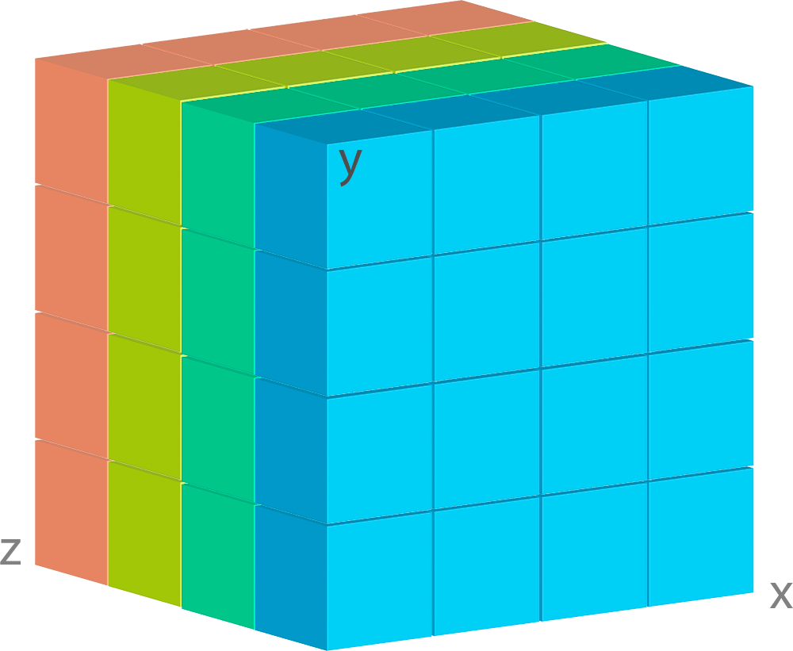
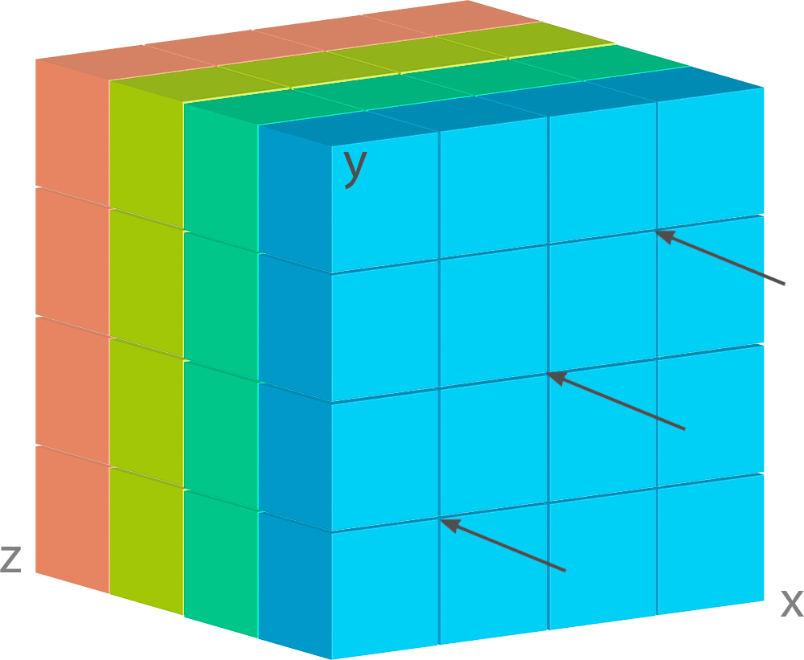
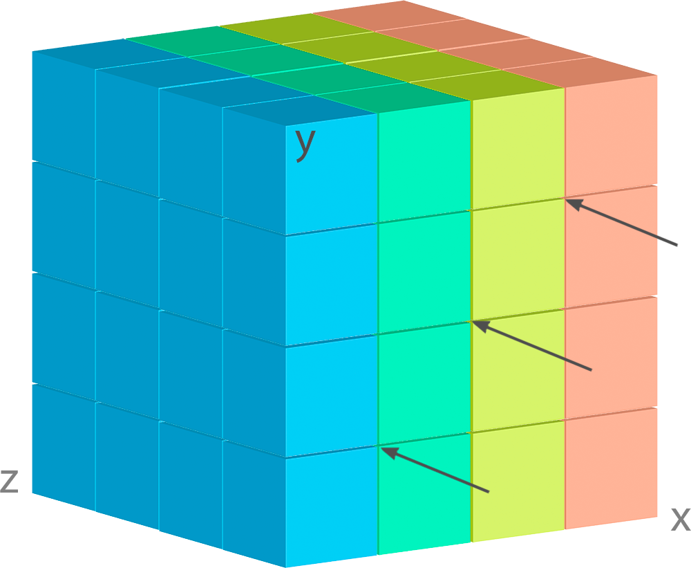
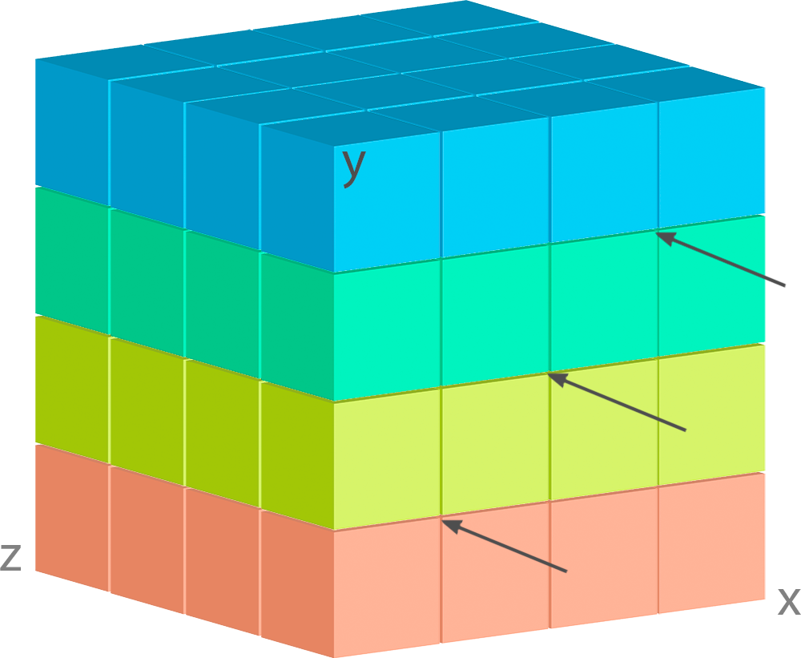

.. currentmodule:: deker

*************
First steps
*************

Introduction
==============

Insofar as Deker is a database, it cannot exist without schemas.

Let's make some high-level parallels with SQL databases. ``Collection`` is an SQL table. It has rows - ``Arrays``
or ``VArrays``. Table columns, their contents and quantity are set up by the table schema which is created as follows ::

   CREATE TABLE table_name (
     column1 datatype,
     column2 datatype,
     column3 datatype,
     ...
   );

Deker ``Collection`` can be a collection either of ``Arrays`` or of ``VArrays``. It's impossible to have the both types
in one ``Collection`` at the same time.

That is why Deker provides two types of schemas:

- ``ArraySchema``
- ``VArraySchema``

And since Deker is a database for numeric data, which is represented as multidimensional arrays, the first thing
you shall do is to define a list of dimensions for your ``Arrays`` or ``VArrays``. For this purpose Deker provides
other two objects:

- ``DimensionSchema``
- ``TimeDimensionSchema``

.. attention:: All schemas are immutable. Once you created a ``Collection`` you **cannot modify** its schema.

Bringing to order
===================

| Obviously, all array's dimensions are placed in a strict order, and this order really matters.
| Let's return to our array image:

.. image:: images/legend.png
   :scale: 28%
   :align: right

As usual, every array has just one *entrance point*. You cannot get inner data without passing through outer layers,
but there is only one *gate* for each layer.

When you decide on the dimensions` positioning, you shall understand and keep in mind your usual querying patterns.
Correct positioning will make the querying faster, a wrong one will slow it.

Assume, that our *gates* are always at the front face, as shown by the arrows, and the dimensions are arranged as
``['x', 'y', 'z']``:

.. image:: images/legend.png
   :scale: 28%
   :align: right

It means that when we query our data, in the first place we capture ``x`` dimension, then ``y`` dimension and only
after that we can get to our weather data. As long as weather layers are under the geo-grid, such a sequence perfectly
fits for querying a pack of weather data for some geo-point(-s).

But what if we place these dimensions in a different manner?

| Now each geo-point contains only one sort of information. Moreover, you can place these dimensions in such a way,
  when weather layers will become the first dimension, for example like
| ``['z', 'y', 'x']``.

It entails that each its cell contains all the geo-grid, and the queries become much slower.

So, before positioning the dimensions, you'd better decide how you are going to query your data and what order is the
most suitable for such queries.

Dimensions' schemas
====================
Each dimension shall have its ``size`` - a precise non-zero positive quantity of its cells with a constant
scalar step ``1``.

We believe that every piece of data shall be described, otherwise it is just a number or a meaningless symbol.
Each dimension, regardless of its type, shall have at least a unique ``name``.

.. note:: The final sequence of your dimensions' schemas represents the exact shape of the future ``Array`` or
   ``VArray``.

DimensionSchema
-----------------
::

    from deker import DimensionSchema

    dimensions = [
        DimensionSchema(name="height", size=255),
        DimensionSchema(name="width", size=512),
    ]

*Even if you need an array with only one dimension, it shall still be defined as a list (or a tuple) of dimension
schemas*::

    dimension = (
        DimensionSchema(name="total_daily_income", size=366),
    )

.. note::
   ``DimensionSchema`` is kept in the ``Collection`` metadata and converted into ``Dimension`` object for
   each ``Array`` or ``VArray`` of such ``Collection``.

All right, now we have a list of two dimensions, named *"height"* and *"width"*. They have some size,
but what are the units? Is there any regular scale for their values? Definitely, there should be.

Scale
~~~~~~
If a dimension has a real regular scale, we may indicate it::

    from deker import DimensionSchema, Scale

    dimensions = [
        DimensionSchema(
            name="height",
            size=255,
            scale=Scale(start_value=0.0, step=0.01, name="meters")
        ),
        DimensionSchema(
            name="width",
            size=512,
            scale={"start_value": 1.0, "step": 0.5}
        ),
    ]

As you can see, regular scale can be defined either with Python ``dict`` or with Deker ``Scale`` named tuple.
The keyword ``name`` is optional. Scale values shall be always defined as ``floats``.

The parameters ``step`` and ``start_value`` may be negative as well. For example, ``era5`` weather model has a
geo-grid shaped ``(ys=721, xs=1440)`` with step ``0.25`` degrees per cell. The zero-point of the ``map`` is north-west
or left-upper corner. In other words ``era5`` grid point ``(0, 0)`` is set to coordinates ``(lat=90.0, lon=-180.0)``.

Here is an example of how this grid can be bound to real geographical coordinates in Deker::

    dimensions = [
        DimensionSchema(
            name="y",
            size=721,
            scale=Scale(start_value=90.0, step=-0.25, name="lat")
        ),
        DimensionSchema(
            name="x",
            size=1440,
            scale={"start_value": -180.0, "step": 0.25, "name": "lon"}
        ),
    ]

Now you can be sure that ``dimensions[0][0], dimensions[1][0]`` are bound to ``lat=90.0, lon=-180.0`` and ``dimensions[0][-1],
dimensions[1][-1]`` are bound to ``lat=-90.0, lon=179.75`` and ``lat=0.0, lon=0.0`` can be found at ``dimensions[0][360],
dimensions[1][720]``.

Labels
~~~~~~~
If a dimension has no real regular scale, but there is still a certain logic in its values order, we may use ``labels``
to describe it::

    dimensions = [
        DimensionSchema(
            name="weather_layers",
            size=4,
            labels=["temperature", "pressure", "wind_speed", "humidity"],
        ),
    ]

You can provide not only a list of ``strings``, but a list (or a tuple) of ``floats`` as well.

Both ``labels`` and ``scale`` provide a mapping of some reasonable information onto your data cells. If ``labels``
is always a full sequence kept in metadata and in memory, ``scale`` is calculated dynamically.

As for the example with ``labels``, we can definitely state that calling index ``[0]`` will provide temperature data,
and index ``[2]`` will give us wind speed and nothing else. The same works for scaled dimensions. For example, height:
index ``[1]`` will keep data relative to height ``0.01 meters`` and index ``[-1]`` - to height ``2.54 meters``

If you set some ``scale`` or ``labels`` for your dimensions, it will allow you to slice these dimensions not only with
``integers``, but also with ``floats`` and ``strings`` *(we will dive into it in the section, relative to fancy
slicing)*.

TimeDimensionSchema
---------------------
If you need to describe some time series you shall use ``TimeDimensionSchema``.

.. note::
   ``TimeDimensionSchema`` is kept in the ``Collection`` metadata and converted into ``TimeDimension``
   object for each ``Array`` or ``VArray`` of such ``Collection``.

``TimeDimensionSchema`` is an object, which is completely described by default, so it needs no additional description.
Thus, it allows you to slice ``TimeDimensions`` with ``datetime`` objects or ``floats`` (timestamps) or even
``strings`` (datetime native standard iso-formatted strings).

Like ``DimensionSchema`` it has ``name`` and ``size``, but also it has its special arguments.

Start value
~~~~~~~~~~~~
::

    from datetime import datetime, timedelta, timezone
    from deker import TimeDimensionSchema

    dimensions = [
        TimeDimensionSchema(
            name="dt",
            size=8760,
            start_value=datetime(2023, 1, 1, tzinfo=timezone.utc),
            step=timedelta(hours=1)
        ),
    ]

We have just defined a schema for a time dimension, which covers all the ``hours`` in the year 2023 starting from
2023-01-01 00:00 to 2023-12-31 23:00 (inclusively).

Direct setting of the ``start_value`` parameter will make this date and time a **common start point** for all the
``Arrays`` or ``VArrays``. Sometimes it makes sense, but usually we want to distinguish our data by individual time.
In this case, it should be defined as follows::

    dimensions = [
        TimeDimensionSchema(
            name="dt",
            size=8760,
            start_value="$some_attribute_name",
            step=timedelta(hours=1)
        ),
    ]

A bit later you will get acquainted with ``AttributesSchema``, but for now it is important to note, that providing
``start_value`` schema parameter with an **attribute's name** starting with ``$`` will let you set an individual
start point for each new ``Array`` or ``VArray`` at its creation.

.. attention::
   For ``start_value`` you can pass a datetime value with any timezone (e.g. your local timezone), but you should
   remember that Deker converts and keeps it in the UTC timezone.

   Before querying some data from ``TimeDimension``, you should convert your local time to UTC to be sure that you get
   a pack of correct data. You can do it with ``get_utc()`` function from ``deker_tools.time`` module.

Step
~~~~
Unlike ordinary dimensions ``TimeDimensionSchema`` shall be provided with ``step`` value, which shall be described as
a ``datetime.timedelta`` object. You may certainly set any scale for it, starting with microseconds, ending with
weeks, it will become a mapping for the dimension scalar indexes onto a certain datetime, which will let you slice
it in a fancy way.

.. admonition:: Hint

   **Why are integers inapplicable to timestamps and to scale and labels values?**

   | Integers are reserved for native Python indexing.

   | If your **timestamp** is an integer - convert it to float.
   | If your **scale** ``start_value`` and ``step`` are integers - define them as corresponding floats.
   | If your **labels** are integers for some reason - convert them to strings or floats.

Attributes' schema
===================
All databases provide some additional obligatory and/or optional information concerning data. For example, in SQL
there are *primary keys* which indicate that data cannot be inserted without passing them.

For this purpose Deker provides **primary and custom attributes** which shall be defined as a list (or a tuple) of
``AttributeSchema``::

    from deker import AttributeSchema

    attributes = [
        AttributeSchema(
            name="some_primary_attribute",
            dtype=int,
            primary=True
        ),
        AttributeSchema(
            name="some_custom_attribute",
            dtype=str,
            primary=False
        ),
    ]

Here we defined a pack of attributes, which will be applied to each ``Array`` or ``VArray`` in our ``Collection``.
Both of them have a ``name`` and a ``dtype`` of the values you are going to pass later.

Regardless their ``primary`` flag value, their names **must be unique**. Valid ``dtypes`` are the following:

- ``int``
- ``float``
- ``complex``
- ``str``
- ``tuple``
- ``datetime.datetime``

The last point is that one of the attributes is ``primary`` and another is ``custom``. What does it mean?

Primary attributes
-------------------
.. note:: Attribute for ``TimeDimension`` ``start_value`` indication shall be dtyped ``datetime.datetime``
   and may be **primary**.

.. attention:: It is highly recommended to define at least one **primary** attribute in every schema.

Primary attributes are a strictly ordered sequence. They are used for ``Arrays`` or ``VArrays`` filtering.
When Deker is building its file system, it creates symlinks for main data files using primary attributes in the symlink
path. If you need to get a certain ``Array`` or ``VArray`` from a ``Collection``, you have two options how to do it:

- to pass its ``id``
- or to indicate **all** its primary attributes' values.

.. attention:: Values for all the primary attributes **must be passed** at every ``Array`` or ``VArray`` creation.

Custom attributes
-------------------
.. note:: Attribute for ``TimeDimension`` ``start_value`` indication shall be dtyped ``datetime.datetime``
   and may be **custom** as well.

No filtering by custom attributes is available at the moment. They just provide some optional information about your
data. You can put there anything, that is not very necessary, but may be helpful for the data managing.

Custom attributes are the only mutable objects of the schema. It does not mean that you can change the schema,
add new attributes or remove old ones. It means that you can change their values (with respect to the
specified ``dtype``) if needed. You can also set their values to ``None``, except the attributes dtyped
``datetime.datetime``.

.. attention::
   | Values for custom attributes **are optional for passing** at every ``Array`` or ``VArray`` creation.
   | If nothing is passed for some or all of them, they are set to ``None``.

   This rule concerns all the custom attributes **except custom attributes dtyped** ``datetime.datetime``.

   Values for custom attributes dtyped ``datetime.datetime`` **must be passed** at every ``Array``  or ``VArray``
   creation and **cannot be set to** ``None``.

.. note:: Defining ``AttributeSchemas`` is optional: you **may not set** any primary or custom attribute
   (**except** attribute for ``TimeDimension.start_value`` indication).

Arrays' schemas
=================
Since you are now well informed about the dimensions and attributes, we are ready to move to the arrays' schemas.
Both ``ArraySchema`` and ``VArraySchema`` must be provided with a list of dimensions' schemas and ``dtype``.
You may optionally pass a list of attributes' schemas and ``fill_value`` to both of them.

Dtype
--------
Deker has a strong data typing. All the values of all the ``Arrays``  or ``VArray`` in one ``Collection`` shall be
of the same data type. Deker accepts numeric data of the following NumPy dtypes:

- ``numpy.int8``
- ``numpy.int16``
- ``numpy.int32``
- ``numpy.int64``
- ``numpy.float16``
- ``numpy.float64``
- ``numpy.float128``
- ``numpy.longfloat``
- ``numpy.double``
- ``numpy.longdouble``
- ``numpy.complex64``
- ``numpy.complex128``
- ``numpy.complex256``
- ``numpy.longcomplex``
- ``numpy.longlong``

Python ``int``, ``float`` and ``complex`` are also acceptable. They are correspondingly converted to ``numpy.int32``,
``numpy.float64`` and ``numpy.complex128``.

Fill value
------------
Sometimes it happens that we have no values for some cells or we want to clear our data out in full or in some
parts. Unfortunately, NumPy does not allow you to set python ``None`` to such cells. That's why we need something that
will fill them in.

Rules are the following:

1. ``fill_value`` **shall not be significant** for your data
2. ``fill_value`` **is optional** - you may not provide it. In this case Deker will choose it automatically basing
   on the provided ``dtype``. For ``integer``-dtypes it will be the lowest value for the correspondent dtype bit
   capacity. For example, it will be ``-128`` for ``numpy.int8``. For ``float``-dtypes (including ``complex``) it will
   be ``numpy.nan`` as this type is also ``floating``.
3. if you'd like to set it manually - ``fill_value`` shall be of the same dtype, that was passed to the ``dtype``
   parameter. If all the values of the correspondent ``dtype`` are significant for you, you shall choose a dtype
   of a greater bit capacity. For example, if all the values in the range ``[-128; 128]`` are valid for your dataset,
   you'd better choose ``numpy.int16`` instead of ``numpy.int8`` and set ``-129`` as ``fill_value`` or let Deker
   to set it automatically. The other workaround is to choose any floating dtype, e.g. ``numpy.float16``, and have
   ``numpy.nan`` as a ``fill_value``.

Now, let's create once again some simple dimensions and attributes for both types of schemas::

    from deker import DimensionSchema, AttributeSchema

    dimensions = [
        DimensionSchema(name="y", size=100),
        DimensionSchema(name="x", size=200),
    ]
    attributes = [
        AttributeSchema(name="attr", dtype=str, primary=False)
    ]

Array schema
----------------
::

    from deker import ArraySchema

    array_schema = ArraySchema(
        dimensions=dimensions,
        attributes=attributes,
        dtype=float,  # will be converted and saved as numpy.float64
        # fill_value is not passed - will be numpy.nan
    )

Now we have a schema for ``Collection`` of ``Arrays``.

VArray schema
--------------
::

    from deker import VArraySchema

    varray_schema = VArraySchema(
        dimensions=dimensions,
        dtype=np.int64,
        fill_value=-99999,
        vgrid=(50, 20)
        # attributes are not passed as they are optional
    )

vgrid
~~~~~~
Perhaps it is one of the most obscure issues. ``VArray`` shall be split into files, but it cannot decide itself how
it shall be done. It's up to you, how you are going to split your data.

``Vgrid`` parameter shall be defined as a tuple of integers which quantity shall be exactly similar to the quantity of
the dimensions. Its values shall divide ``VArray`` shape without remainders.

Our schema has two dimensions with sizes ``100`` and ``200`` correspondingly, what tells us that the ``VArray``
shape will be ``(100, 200)``. And we set ``vgrid`` as ``(50, 20)``. What shall happen? No magic, just a simple math::

    (100, 200) / (50, 20) = (2.0, 10.0)

``(2, 10)`` - that will be the shape of all the ``Arrays``, produced by the ``VArray``.

If we do not want to divide any dimension into pieces and want to keep it in full size in all the ``Arrays``, we shall
pass ``1`` in ``vgrid`` for that dimension::

    (100, 200) / (1, 20) = (100.0, 10.0)

| Thus, the first dimension will retain its initial size for all the arrays, and their shape will be
| ``(100, 10)``.

Ok! Now we are finally ready to create our first database and we need ``Client``.

Creating a database
====================
``Client`` is responsible for creating connections and its internal context.

As far as Deker is a file-based database, you need to provide some path to the storage, where your collections will
be kept.

.. note::
   | Deker was developed and tested on Unix platforms and perfectly works with Unix file systems.
   | We would appreciate any feedback from MS Windows users.

URI
----
There is a universal way to provide paths and connection options: an URI.

The scheme of URI-string for embedded Deker databases, stored on your local drive, is ``file://``.
It shall be followed by a path to the directory where the storage will be located. If this directory (or even full path
to it) does not exist, Deker will create it at ``Client`s`` opening.

.. note:: Relative paths are also applicable, but it is recommended to use absolute paths.

   *Explicit is better than implicit.* *Zen of Python:2*

In this documentation we will use a reference to a temporary directory ``/tmp/deker``::

   uri = "file:///tmp/deker"

Client
-------
Now open the Client for interacting with Deker::

   from deker import Client

   client = Client(uri)

You can use it as a context manager as well::

   from deker import Client

   with Client(uri) as client:
       <...some client-job here...>

``Client`` opens its connections and inner context at its instantiation. If you use context manager, it will close them
automatically on exit. Otherwise the connections and context will remain opened until you call ``client.close()``
directly.

If for some reason you need to open and close ``Client`` in different parts of your code, you may define it only once
and reuse it by calling a context manager::

   from deker import Client

   client = Client(uri)
   <...some client-job here...>
   client.close()

   <some job here>

   with client:
       <some client-job here>

   <some job here>

   with client:
       <some client-job here>

Putting together
----------------
Great! Now let's assemble everything from the above scope and create an ``Array`` collection of some world-wide
weather data.

::

    from datetime import datetime, timedelta
    from deker import (  # in order of appearance
        TimeDimensionSchema,
        DimensionSchema,
        Scale,
        AttributeSchema,
        ArraySchema,
        Client,
        Collection
    )

    dimensions = [
        TimeDimensionSchema(
            name="day_hours",
            size=24,
            start_value="$dt",
            step=timedelta(hours=1)
        ),
        DimensionSchema(
            name="y",
            size=181,
            scale=Scale(start_value=90.0, step=-1.0, name="lat")
        ),
        DimensionSchema(
            name="x",
            size=360,
            scale=Scale(start_value=-180.0, step=1.0, name="lon")
        ),
        DimensionSchema(
            name="weather",
            size=4,
            labels=["temperature", "humidity", "pressure", "wind_speed"]
        ),
    ]
    attributes = [
        AttributeSchema(name="dt", dtype=datetime, primary=True),
        AttributeSchema(name="tm", dtype=int, primary=False),
    ]

    array_schema = ArraySchema(
        dimensions=dimensions,
        attributes=attributes,
        dtype=float,  # will be converted and saved as numpy.float64
        # fill_value is not passed - will be numpy.nan
    )

    with Client(uri="file:///tmp/deker") as client:
        collection: Collection = client.create_collection("weather", array_schema)
    print(collection)  # "weather"

**We did it!**

Now there is a new path ``/tmp/deker/collections/weather`` on your local drive where Deker will store the data relative
to the ``Collection`` named ``weather``. Each ``Array`` will contain a pack of daily 24-hours weather data for each
entire latitude and longitude degree: ``temperature``, ``humidity``, ``pressure`` and ``wind_speed``.
