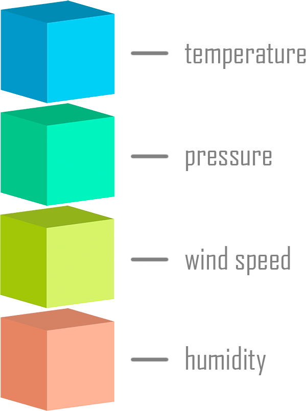
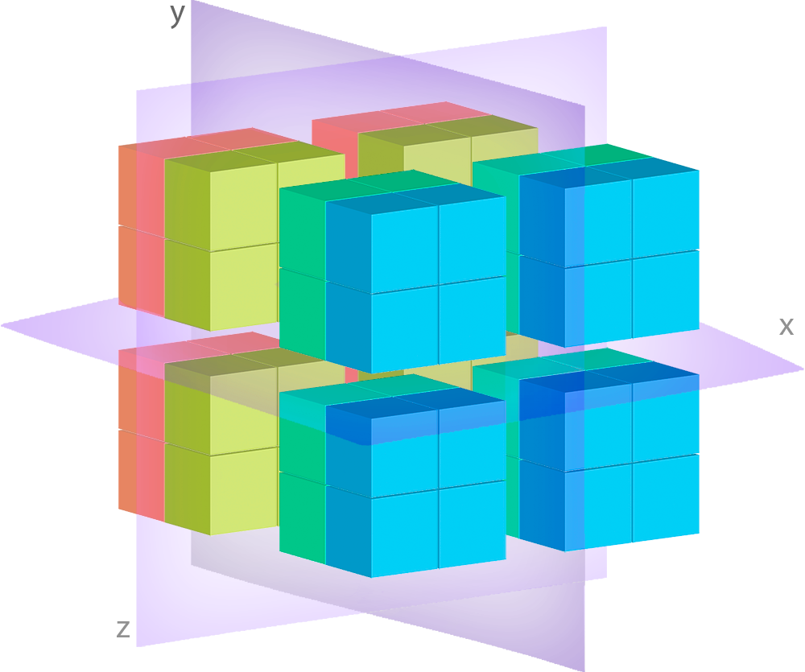
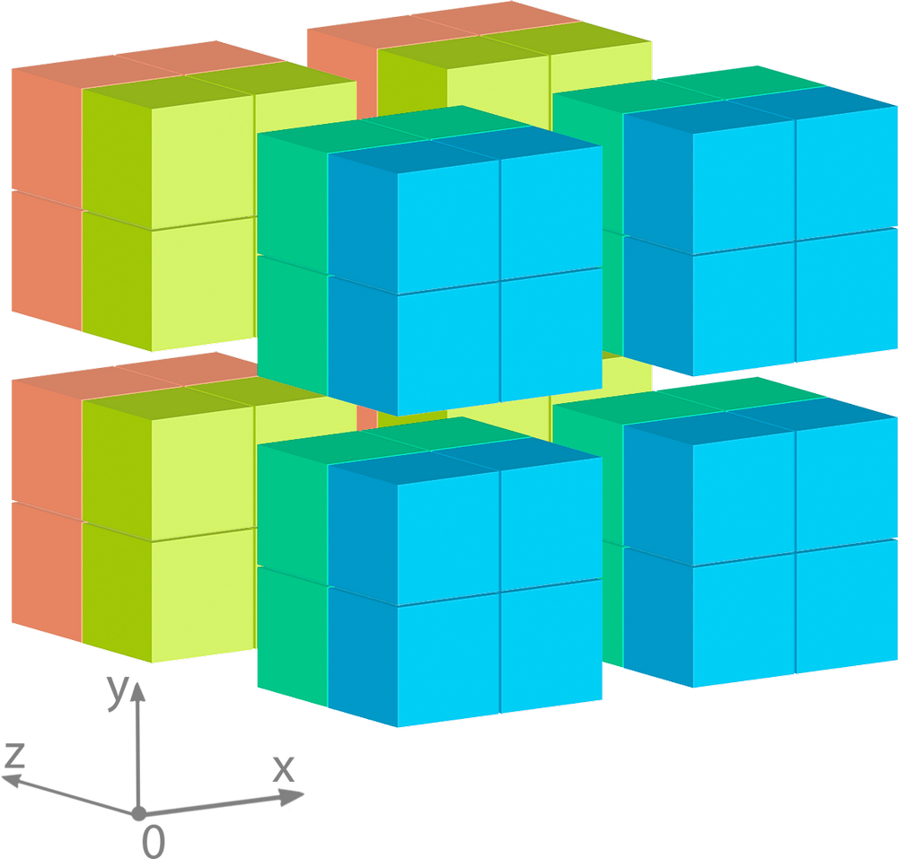
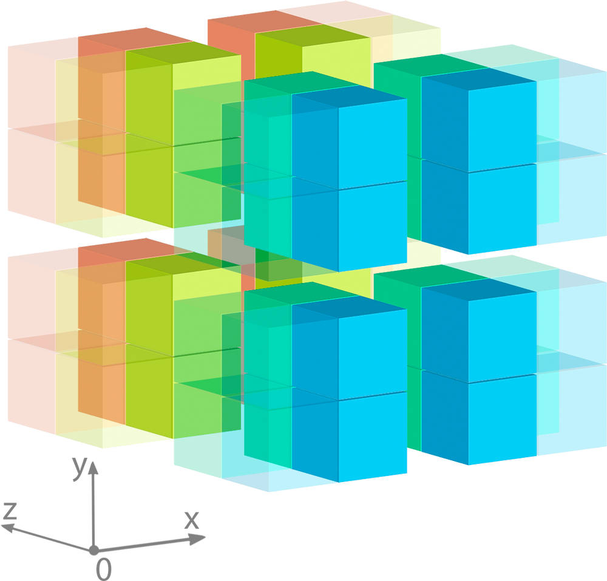

********
Overview
********

Deker allows you to define separate storage collections for different kinds of arrays that are
described with own dimensions schemas, stored data type and array level metadata attributes. It
enables you to find and array in collection using it's metadata and then access any part of it
using convenient slicing syntax.

Deker was also built with scalability and flexibility in mind, so all data is stored and accessed
via the separate abstraction level of **storage adapters** which enables flexibility and
scalability in the future. Currenly there is ``deker-local-adapters_`` package that implements
local filesystem storage in HDF5_ format.

.. _HDF5: https://www.h5py.org
.. _deker-local-adapters: https://github.com/openweathermap/deker-local-adapters

Interfaces
==========

Accessing Data
--------------

Deker APIs are designed to be as simple and user friendly as possible. There are only few
self-explanotary high-level objects that you would need to interact with:

   * :class:`Client <deker.client.Client>`
   * :class:`Collection <deker.collection.Collection>`
   * :class:`Array <deker.arrays.Array>` or :class:`VArray <deker.arrays.VArray>`
   * :class:`Subset <deker.subset.Subset>` or :class:`VSubset <deker.subset.VSubset>`

``Client`` is the first object you start with. It is used for managing and accessing
``Collection`` of ``Array`` or ``VArray`` objects.

``Array`` is a representation of data array stored in a separate physical file.

``VArray`` (or **virtual array**) is an abstraction that represents bigger array that for
scalability reasons is split into multiple separate physical files. This approach in addition to
scalable parallel storage access enables concurrent read and update operations to be performed on
the same logical virtual array object.

You may think about ``VArray`` as of huge image that was split into equally sized tiles using
some regular grid.

You may decide if you want to store arrays or virtual arrays in your collections based purely on
performance and storage scalability considerations, as from the developer point of view there is no
there is no difference between ``VArray`` and ``Array`` interfaces.

Once you have located required array or virtual array in your collection, to access its actual data
you need just to create a slice from your ``Array`` or ``VArray`` object, thus getting ``Subset``
or ``VSubset``.

``Subset`` and ``VSubset`` also have the same interface and they are the final lazy objects, which
expose methods for data update, read and clear.

Creating Collection
-------------------

To create a new ``Сollection`` you will need a few more objects:

   * :class:`DimensionSchema <deker.schemas.DimensionSchema>`
     and/or :class:`TimeDimensionSchema <deker.schemas.TimeDimensionSchema>`
   * :class:`AttributeSchema <deker.schemas.AttributeSchema>`
   * :class:`ArraySchema <deker.schemas.ArraySchema>`
     or :class:`VArraySchema <deker.schemas.VArraySchema>`

``DimensionSchema`` and ``TimeDimensionSchema`` contain information about array and virtual array
dimensions, such as dimension size, and optional labels or scale linked to dimension indexes.

``AttributeSchema`` describes metadata attributes that will be stored with array or virtual array.

``ArraySchema`` and ``VArraySchema`` aggregate information about array dimensions with description
of stored data type and metadata attributes. For virtual array schema also contains information
about tiling grid to be applied (``vgrid``).

Understanding Arrays
====================

``Array`` and ``VArray`` objects represent core concepts of Deker storage. Here we will describe
structure, differences and commonalities of them and give overview of when either of them should
be used.

Array
------

As previously mentioned, ``Array`` is a wrapper over physical files containing actual array data.
This object does not provide direct access to reading data, but it knows everything about its
properties.

.. |cell| image:: images/cell.png
   :scale: 5%

Each array is made of cells |cell| - containers for singular data values.

Here is an example of a simple 3-dimensional array with some current weather data:

.. image:: images/array_0_axes.png
   :scale: 30%

Let's assume that ``X`` and ``Y`` axes represent some geographical grid, and ``Z`` axis represents
layers with particular weather parameters, as shown in the legend.

It is a single ``Array`` having 4 cells in each dimension, in other words its shape is
``(4, 4, 4)``.

Deker stores this data in a single file, and when we retrieve corresponding ``Array`` object from
the ``Collection``, it will point to this particular file and all operations with its data will 
affect this file only.

VArray
-------

Now lets have a look at the ``VArray`` structure:

.. image:: images/array_0_axes.png
   :scale: 30%

No, it is not a mistake. Both ``Array`` and ``VArray`` have the same interface and same properties
of data stored, so there is no visible difference between them from the developer point of view.

But there is a significant difference under the hood.

Imagine that you need to store a high-resolution image of something really like whole Earth
surface. Let's suppose that size of such image would be 300000 X 200000 px. It is really huge and
will lead to huge size of filesystem objects and significant RAM size to be stored and accessed as
a single file.

To enable this type of data storage, Deker uses tiling, i.e. split huge arrays into smaller arrays,
place them in separate files and transparently join them into for user access as virtual array.
It probably would still be impossible to access this huge array as a whole. but it enables efficient
access to digestable parts of it piece by piece.

``VArray`` is a wrapper over such a set of files. You can see how ``vgrid`` cuts it into separate
tiles in the above image. Each separate tile is an ``Array``, which lays under ``VArray``.

If ``Collection`` is defined to contain ``VArray`` objects, you don't have to worry about tiling,
Deker would transparently manage this for you under the hood.

When some slice of data is queried from the ``VArray``, it automatically calculates which files
need to be opened to retrieve it and what part of requested slice data bounds belong to each of
each file.

For example, let's consider ``VArray`` with dimensions ``['X', 'Y', 'Z']`` and shape ``(4, 4, 4)``,
with its *zero-index* at the front-left-bottom corner.

Let's query the following slice of it: ``[:, 2:4, :]``

Here you can see, that all 4 tile files will be affected, but only the highlighted pieces of them
will be actually read. All different files reads will be done in parallel. Deker will then combine
each read piece into subset with requested shape and return it to you. If you use these bounds to
write data, Deker will auttomatically split the slice you have provided into pieces and write them
in parallel to corresponding files.

