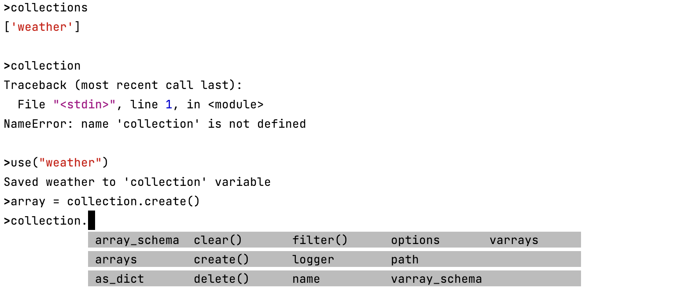
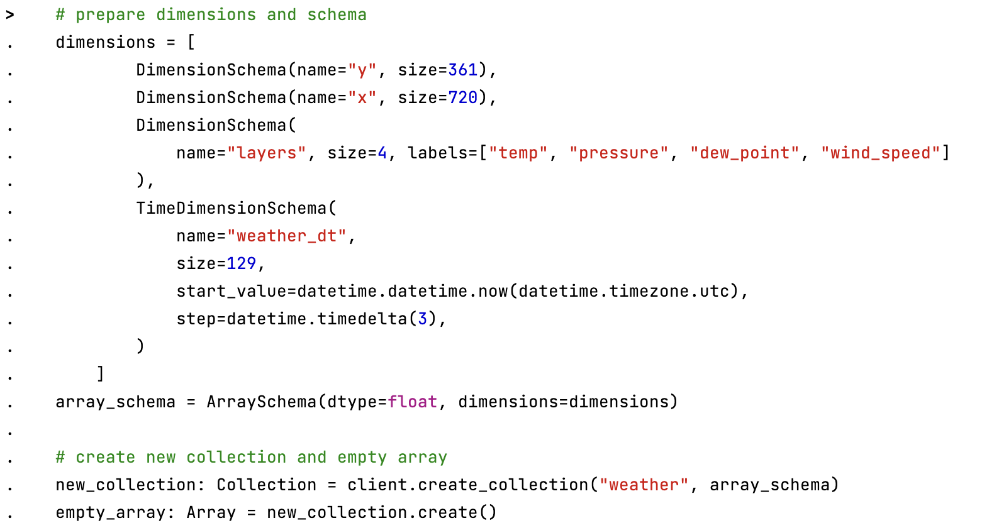
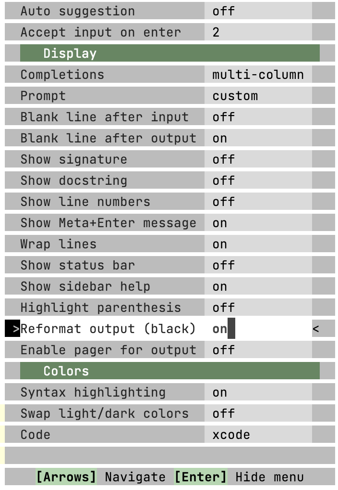

*******************
Interactive shell
*******************

Deker-shell provides Python REPL interface for Deker, offering features like autocompletion, preset variables,
and enhanced REPL functionality through Ptpython.

Start
=========
You need Deker and python>=3.9 installed.

.. code-block:: bash

    pip install deker deker-shell
    deker --version  # 1.0.0
    deker file:///tmp/deker

Features
=========
- autocompletion
- syntax highlighting
- preset ``client`` and ``collections`` variable
- default ``collection`` variable with 'use' method
- Deker and Ptpython features

Examples
=========
Using global collection variable

Creating a new collection

Press ``F2`` for menu

Interface
=========

Imported Deker classes
-----------------------
management
++++++++++++
- :class:`Client <deker.client.Client>`
- :class:`Collection <deker.collection.Collection>`
- :class:`Array <deker.arrays.Array>`
- :class:`VArray <deker.arrays.VArray>`
- :class:`Subset <deker.subset.Subset>`
- :class:`VSubset <deker.subset.VSubset>`

schemas
++++++++++++
- :class:`DimensionSchema <deker.schemas.DimensionSchema>`
- :class:`TimeDimensionSchema <deker.schemas.TimeDimensionSchema>`
- :class:`ArraySchema <deker.schemas.ArraySchema>`
- :class:`VArraySchema <deker.schemas.VArraySchema>`
- :class:`AttributeSchema <deker.schemas.AttributeSchema>`

options
++++++++++++
- :class:`HDF5Options <deker_local_adapters.storage_adapters.hdf5.hdf5_options.HDF5Options>`
- :class:`HDF5CompressionOpts <deker_local_adapters.storage_adapters.hdf5.hdf5_options.HDF5CompressionOpts>`
- :class:`Scale <deker.types.public.classes.Scale>`

Preset variables
------------------
- ``client``: Client (registry of collections) instance, connected to the uri-database
- ``collections``: list of Client collections names
- ``collection``: global default collection variable, set by use("coll_name") method;
- ``np``: numpy library
- ``datetime``: datetime library

Methods
---------
- ``use("collection_name")``: gets collection from client and saves it to ``collection`` variable
- ``get_global_coll_variable()``: returns ``collection`` global variable

.. admonition:: Special thanks to

   `Ptpython <https://github.com/prompt-toolkit/ptpython>`_ - advanced Python REPL
