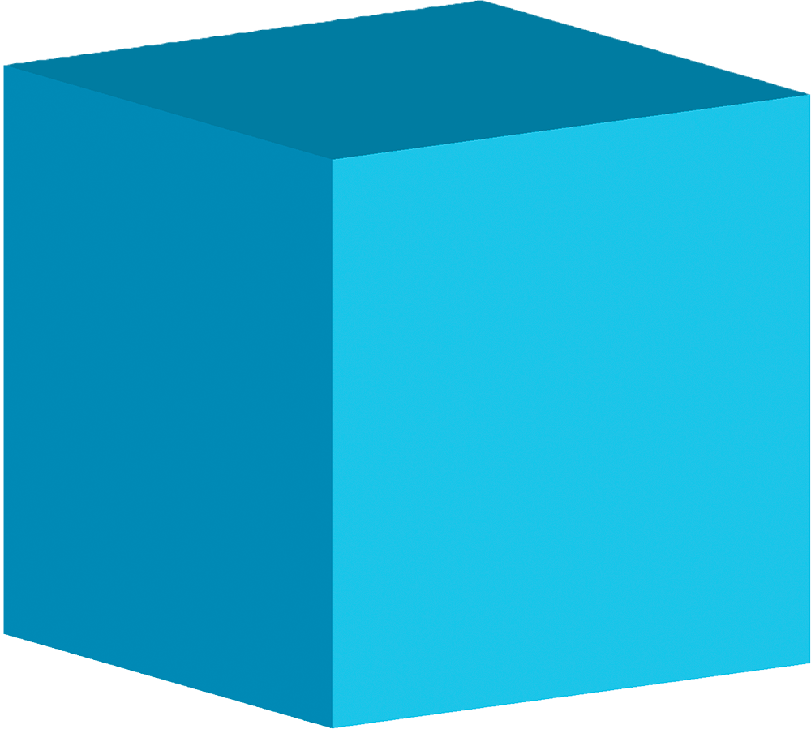
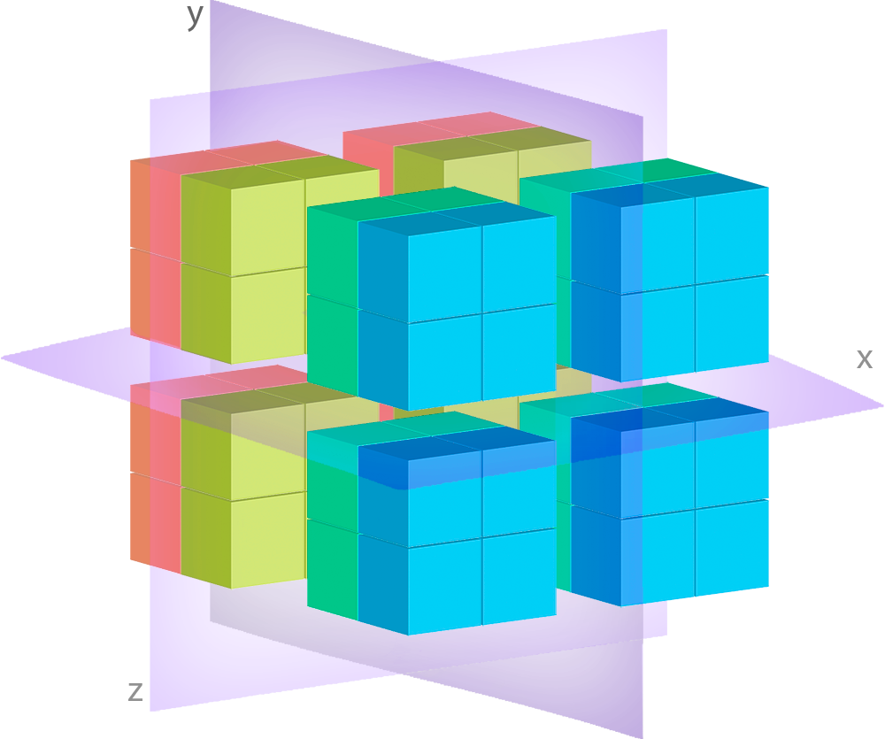
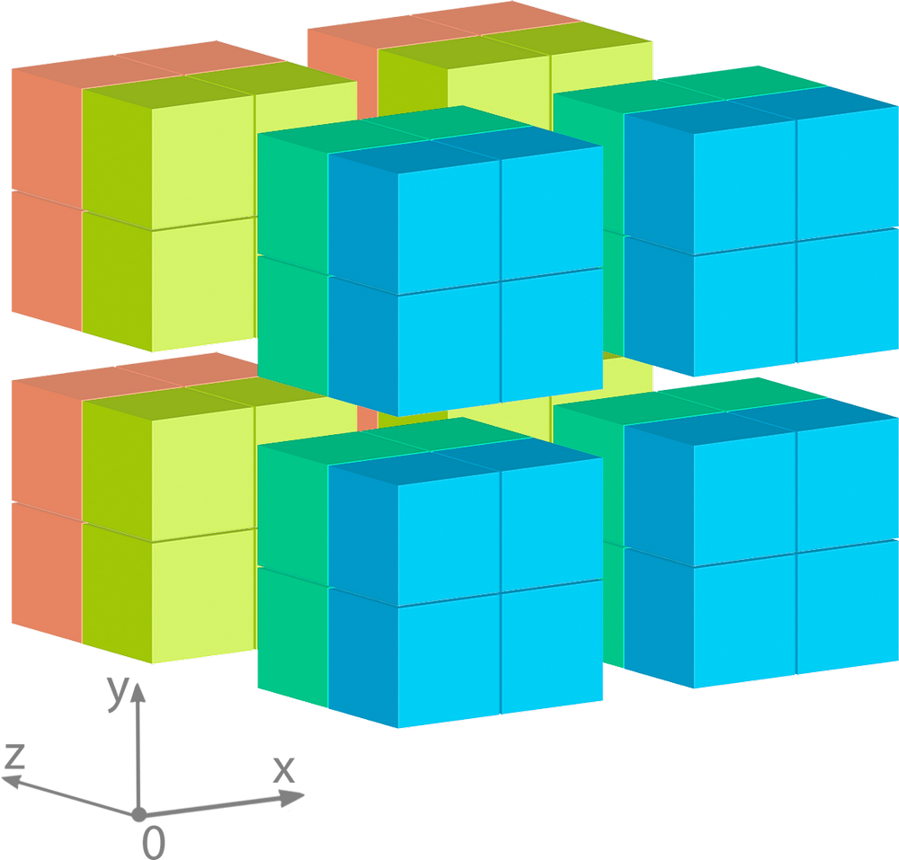
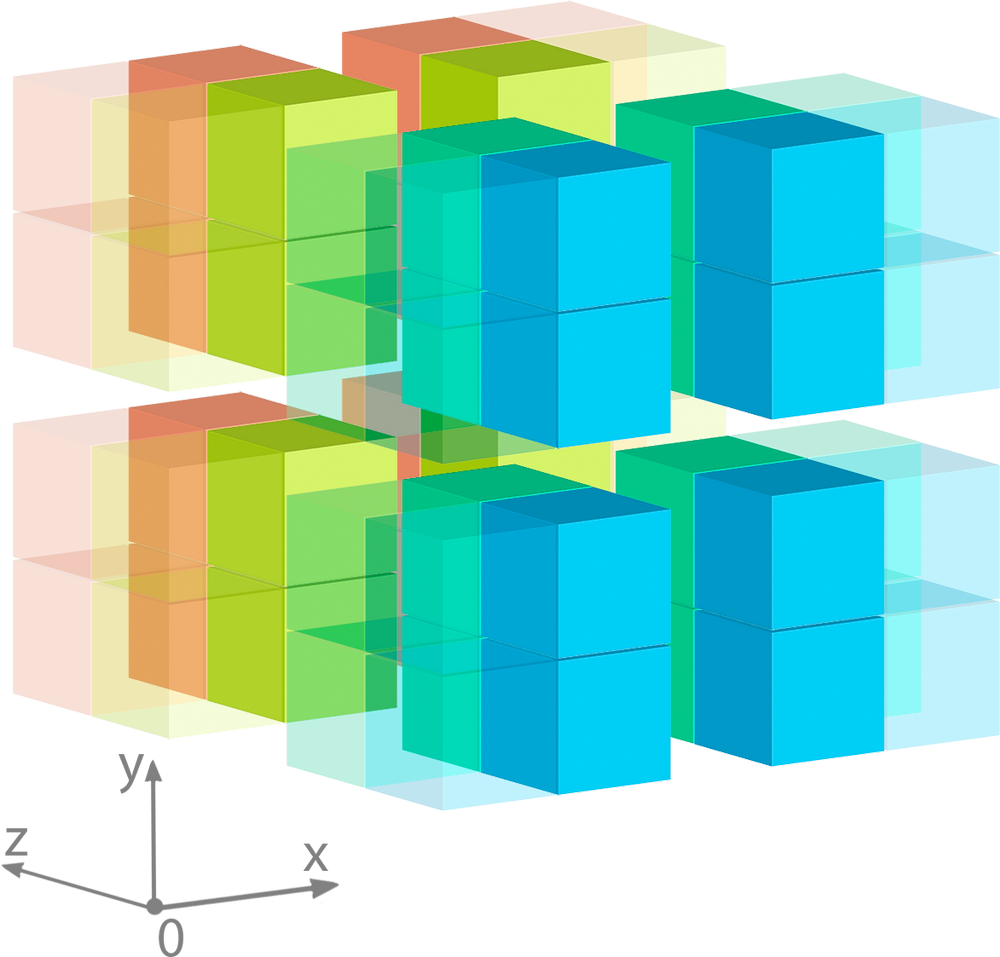

***********
Why Deker?
***********

Deker was made with the aims:
   - to easily write and read big amounts of data;
   - to be thread and process safe;
   - to be lazy as long as it can be.

It means that Deker can operate the datasets limited only by the size of your available free RAM.
To some extent it resembles an ORM over a database, but it is still a database.

How it works
================
| In contrast with similar decisions Deker's interfaces are quite simple and user-friendly.
| It has a few high-level objects for data managing:

- :class:`Client <deker.client.Client>`
- :class:`Collection <deker.collection.Collection>`
- :class:`Array <deker.arrays.Array>` or :class:`VArray <deker.arrays.VArray>`
- :class:`Subset <deker.subset.Subset>` or :class:`VSubset <deker.subset.VSubset>`

``Client`` is the first object you start with. It is being used for creating and getting ``Collections`` of ``Arrays``
or ``VArrays`` basing on the collection schema.

The data has a representation of arrays and is stored in files with the help of ``deker-local-adapters`` plugin.
Deker provides two types of high-level objects for data managing with the same interface: ``Array`` and ``VArray``.

What is the difference? ``Array`` is an abstract wrapper over final low-level arrays (or files) containing data.
``VArray`` *(or Virtual Array)* is an "array of ``Arrays``" or an "image of pixels".
If we consider VArray as an image, it is split by virtual grid into some tiles having the similar shape.
In this case, each tile is an ordinary ``Array``, and each ``Array`` is a file. But for a user there is no difference
between ``VArray`` and ``Array`` interfaces.

To access the data you need just to create a slice from your ``Array`` or ``VArray``, thus you'll get a new object
called ``Subset`` or ``VSubset``.

``Subset`` and ``VSubset`` also have the same interface and they are the final lazy objects, which possess methods
for direct data updating, reading and clearing.

For creating a new ``Сollection`` you will need a few more objects:

- :class:`DimensionSchema <deker.schemas.DimensionSchema>` and/or
  :class:`TimeDimensionSchema <deker.schemas.TimeDimensionSchema>`
- :class:`ArraySchema <deker.schemas.ArraySchema>` or :class:`VArraySchema <deker.schemas.VArraySchema>`
- :class:`AttributeSchema <deker.schemas.AttributeSchema>` (optionally, but highly recommended)

And optionally you may need:

- :class:`HDF5Options <deker_local_adapters.storage_adapters.hdf5.hdf5_options.HDF5Options>` and :class:`HDF5CompressionOpts <deker_local_adapters.storage_adapters.hdf5.hdf5_options.HDF5CompressionOpts>`
- :class:`Scale <deker.types.public.classes.Scale>`

Features
==========

1. ``VArrays``
2. Own locks
3. Strong data typing.
4. FancySlicing: use ``datetime``, ``floats`` and ``strings`` instead of ``integers`` for ``Arrays`` and ``VArrays``
   slicing (available for ``Dimensions`` described with ``labels`` or ``scale`` parameters and for ``TimeDimensions``)
5. Reading your data as ``xarray.DataArray`` with further possibility of conversion to different formats
   (refer to the DataArray_ ``to_...`` methods)
6. Data compression and chunking (available for ``HDF5``)

.. _DataArray: https://docs.xarray.dev/en/stable/generated/xarray.DataArray.html

Understanding Array and VArray
================================

Array
------
As previously mentioned, ``Array`` is an abstract wrapper over files containing data. It does not have a direct access
to the data, but it knows everything about its properties and options.

| An array is made of cells - |cell| - containers for data pieces.
| Here is an example of a simple 3-dimensional array with some weather data:

.. image:: images/array_0_axes.png
   :scale: 30%

.. image:: images/legend.png
   :scale: 28%
   :align: right

Let's assume that ``x`` and ``y`` axes represent some geographical grid, and ``z`` axis represents layers
with weather data, as shown in the legend.

It is a single ``Array`` having 4 cells in each dimension, in other words its shape is ``(4, 4, 4)``.

Deker stores this data in a single file, and when we call this ``Array`` from the correspondent ``Collection``, all the
operations with its data will affect this file.

So, it is quite simple: one ``Array`` - one file.

VArray
-------
And here comes ``VArray``!

.. image:: images/array_0_axes.png
   :scale: 30%

No, it is not a mistake. Both ``Array`` and ``VArray`` have the same interface, so there is no visible
difference between them for a user.

.. attention:: But there is a difference under the hood!

Imagine that you need to create a photo of something really big with a very high resolution, for example a photo
of the Earth. Suppose the size of the image is 300.000 px * 200.000 px. It is really huge and requires incredibly
much space on a drive and a lot of RAM to be processed. Obviously, nowadays it is impossible to upload it promptly
to physical memory. Moreover, it may require several storage drives to be written down, as its final size depends
on the data type.

How this problem can be solved? We can make a lot of small shots, place them in separated files and arrange them
in the correct order. We certainly will not be able to see the full picture, but we will be able to browse it piece
by piece.

``VArray`` is a virtual wrapper over such a set of files. You can see how ``vgrid`` cuts it into separated pieces
in the above image. Each separate piece is an ``Array``, which lays under ``VArray``. And as previously stated, one
``Array`` is one file. If your ``Collection`` is a collection of ``VArrays``, you don't have to worry about ``Arrays``,
``VArray`` manages them for you.

When we query some piece of data, ``VArray`` calculates which files to open and what bounds to impose on each
of these files.

For example, we have the same VArray: its shape is ``(4, 4, 4)``, its dimensions are arranged as ``['x', 'y', 'z']``
and its *zero-index* is at the front-left-bottom corner.

Let's query it in the following way: ``VArray[:, 2:4, :]``

Here you can see, that all of 4 files will be affected, but only the highlighted parts of them will be captured.
If you use these bounds for **inserting or updating**, ``VArray`` will distribute your input data within the proper
files and in the correct order. If you use them for **reading**, ``VArray`` will aggregate all the captured parts into
one ``numpy.ndarray`` of the correspondent shape and in the correct order and return it to you. And, obviously, the
captured parts will be **cleared**, if you so wish.

Pursuing the aim to be fast, ``VArray`` uses its own ``ThreadPoolExecutor`` to cope with all the tasks it needs to do.
In the interest of thread-safety Deker uses its own file locks for all sorts of file operations: creating, reading,
writing and deleting.
