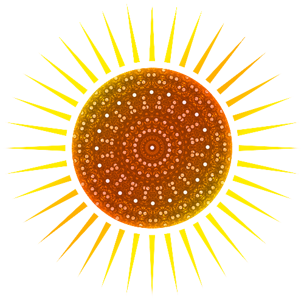

Deker documentation
====================
**Welcome to Deker!**

Deker - is a pure-Python NoSQL database framework, which provides storing multidimensional spatial raster
numeric data and its further simple, fast and comfortable accessing and managing.

.. admonition:: What is Deker?

   **Deker** is a short name for a **dekeract** or `10-cube (ten-dimensional hypercube)`_.

.. _10-cube (ten-dimensional hypercube): https://en.wikipedia.org/wiki/10-cube

It perfectly fits for a vast variety of data:

- geospatial data (cartography, geodesy, meteorology, …, even outer space),
- images,
- video,
- audio,
- biomedicine,
- genomics,
- finance,
- ML,
- ...

and many others – everything that may be represented and stored as a pack of numbers.

Deker is not really limited by a number of dimensions – it’s up to you to decide how complicated your structures
shall be and how many dimensions you use `(our current goal is 5, at the moment)`.

| Actually, it is a scalable high-level wrapper over different file formats.
| At the moment Deker supports just ``HDF5``, but we’ll be glad to accept PRs with new storage adapters:
  ``TIFF``, ``NetCDF``, ``ZARR``, … Any format you like and need, even ``JSON`` or ``TXT``.

Deker uses NumPy_ structures and provides an additional support for Xarray_, pandas_ and others.

.. _NumPy: https://numpy.org/doc/stable/
.. _Xarray: https://docs.xarray.dev/en/stable/
.. _pandas: https://pandas.pydata.org/docs/

Deker open source ecosystem:
   - deker
   - deker-local-adapters
   - deker-shell
   - deker-tools

.. toctree::
   :hidden:
   :caption: Tutorials

   Why Deker <deker/why_deker>
   Installation <deker/installation>
   First steps <deker/first_steps>
   Data management <deker/data_management>
   Fine tuning <deker/fine_tuning>
   Interactive shell <deker/shell>

.. toctree::
   :hidden:
   :caption: API Reference

   Deker API <deker/api/modules>
   Deker-tools <deker/api/deker_tools/modules>

.. toctree::
   :hidden:
   :caption: About us

   GitHub <https://github.com/openweathermap>
   OpenWeather <https://openweathermap.org/>
